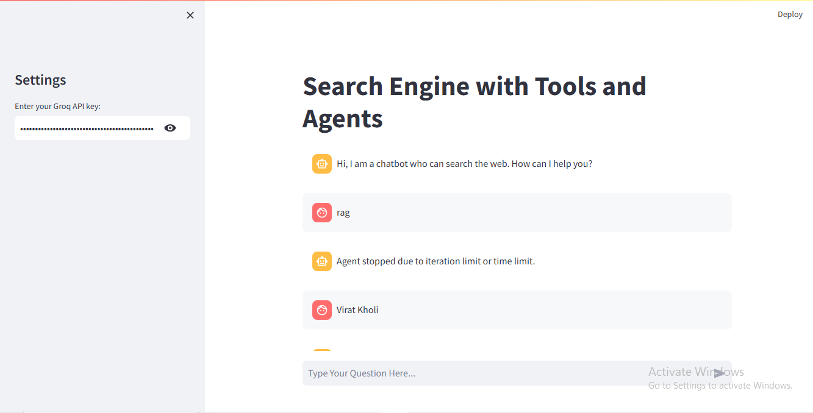

# Search Engine with Tools and Agents

This repository hosts a Streamlit-based application that acts as a chatbot, capable of searching Wikipedia and Arxiv using tools and agents powered by the LangChain framework. The bot integrates Groq LLM (using ChatGroq) to deliver insightful and accurate responses. The app is designed for interactive and user-friendly querying.

## Features

- **Wikipedia Search**: Fetch concise and relevant content from Wikipedia articles.
- **Arxiv Search**: Retrieve academic papers and summaries from Arxiv.
- **Interactive Chat Interface**: Powered by Streamlit for real-time interaction.
- **Agent-Based Search**: Utilizes LangChain agents for tool selection and response generation.
- **Customizable Settings**: Includes API key input via a Streamlit sidebar.
- **Session Persistence**: Keeps track of user and assistant messages during the session.

## Installation

1. **Clone the Repository**:
    ```bash
    git clone https://github.com/yourusername/search-engine-with-agents.git
    cd search-engine-with-agents
    ```

2. **Create a Virtual Environment**:
    ```bash
    python -m venv env
    source env/bin/activate   # On Windows, use `env\Scripts\activate`
    ```

3. **Install Dependencies**:
    ```bash
    pip install -r requirements.txt
    ```

4. **Set Up Environment Variables**:
    - Create a `.env` file in the root directory and add your Groq API key:
      ```env
      GROQ_API_KEY=your_api_key_here
      ```

## Usage

1. **Run the Streamlit App**:
    ```bash
    streamlit run app.py
    ```

2. **Interact with the Chatbot**:
    - Open the provided URL in your browser.
    - Enter your Groq API key in the sidebar.
    - Type your question in the input box and receive responses enhanced with Wikipedia and Arxiv search results.

## Code Overview

### `app.py`
The main application script that:
- Sets up the Streamlit interface.
- Initializes the Wikipedia and Arxiv tools.
- Configures the LangChain agent with the Groq LLM.
- Handles user interaction and chatbot responses.

### `requirements.txt`
Contains all the Python dependencies for the project:
- `streamlit`
- `langchain`
- `dotenv`
- `groq` (or equivalent for ChatGroq)

## Supported Tools

### Wikipedia
- **API Wrapper**: Fetches and limits content from Wikipedia.
- **Integration**: Powered by `langchain_community.utilities.WikipediaAPIWrapper` and `langchain_community.tools.WikipediaQueryRun`.

### Arxiv
- **API Wrapper**: Retrieves summaries of academic papers from Arxiv.
- **Integration**: Powered by `langchain_community.utilities.ArxivAPIWrapper` and `langchain_community.tools.ArxivQueryRun`.

## Future Improvements

- Add support for more tools (e.g., YouTube, PubMed, etc.).
- Enhance session storage for long-term user interactions.
- Improve error handling for API calls and invalid inputs.

## Contributing

Contributions are welcome! Feel free to open issues or submit pull requests.

## License

This project is licensed under the MIT License. See the `LICENSE` file for details.

## Acknowledgments

- [Streamlit](https://streamlit.io/) for the interactive interface.
- [LangChain](https://langchain.com/) for the tool and agent framework.
- [Groq](https://groq.com/) for the powerful LLM integration.


